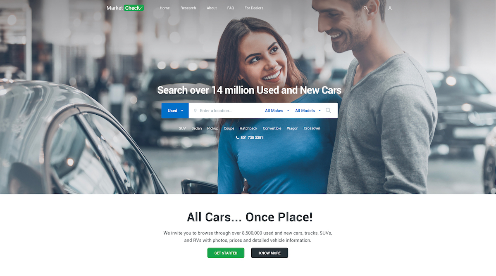

# MarketCheck

[](https://code.pixel2html.com/clients/project-4566/commits/master)

[](https://github.com/standard/standard)

[](#stack)

Here will live the code for MarketCheck made with React.

## Quick Start

```
$ yarn
$ yarn dev
```

Deployment time

```
$ yarn build
$ yarn start
```

Test

```
$ yarn test
```

## Stack

* [React ⚛️](https://facebook.github.io/react/)
* [Styled-Components 💅](https://www.styled-components.com)
* [Polished.js ✨](https://polished.js.org)
* [nprogress ⚡️](http://ricostacruz.com/nprogress/)
* [Next.JS 💨](https://zeit.co/blog/next3-preview)
* [Jest 🙀](https://facebook.github.io/jest/)
* [Enzyme 🛌](http://airbnb.io/enzyme/)
* [Express ✏️](https://expressjs.com)
* [Now ☁️](https://zeit.co/now)

## Still Deciding...

* [Recharts.js](http://recharts.org/#/en-US) React + D3 = 🐶
* [VX](https://github.com/hshoff/vx) React + D3 = 🦄. Too beta 🤔

## Babel Plugins

* root-import: For relative imports use `~/` for `components` and `@/` for `containers`
* styled-components: So we can use styled-components both on server and client

* inline-react-svg: To import svgs easily as react components:

```javascript
import Cat from '../svgs/cat.svg'

export default () => (
  <div>
    <marquee>SVG Cat!</marquee>
    <Cat />
  </div>
)

```

## Questions

[Pixel2HTML](https://pixel2html.com/) for support or questions
